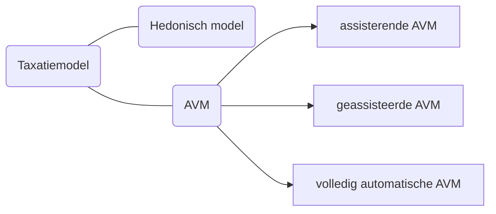

 # TAXATIE-MODELLEN PRO/CONS-LIJST

 ### Algemene bronnen: 
- [*European Standards for Statistical Valuation Methods for Residential Properties* 3rd Edition](https://www.europeanavmalliance.org/files/eaa/Downloads/EAA_Standards_3rd_Edition.pdf)
- [*The Next Generation of AVMs*, C. A. Lipscomb](https://www.iaao.org/media/Topics/AVMs/FE_March_Lipscomb.pdf)

 ## [HEDONISCHE MODELLEN](hedonic.md)

|***+***|***Pros***|
|-|-
|1.|De methode is gebaseerd op werkelijk keuzegedrag van kopers en geeft hierdoor een intuïtief resultaat
|2.|Het is duidelijk te onderbouwen hoe de modelwaarde is bereikt aan de hand van de gegeven informatie
|3.|Er is geen locatie-informatie nodig op een kleinere schaal dan het gekozen gebied

|***-***|***Cons***|
|-|-
|1.|Deze modellen zijn sterk afhankelijk van geaggregeerde informatie, met name op geografisch vlak. 
|2.|Hedonische modellen gaan er vanuit dat alle eigenschappen die een significante bijdrage leveren aan de daadwerkelijke waarde in het model zijn meegenomen. Indien niet-meegenomen attributen ook een significant effect hebben op de waardering, dan leidt dit tot een lagere nauwkeurigheid van het model
|3.|Daarnaast wordt ook de aanname gemaakt dat de _potentiële kopers_ volledige kennis van al deze eigenschappen, en ook wat de invloed van alle attributen is op de leefervaring
|4.|De afhankelijkheid van de modelwaarde op een attribuut is niet altijd onafhankelijk van de overige attributen, ook is het mogelijk dat bepaalde attributen altijd tegelijk voorkomen waardoor de invloed van deze attributen niet onafhankelijk onderzocht kunnen worden 
|5.|Het is van tevoren niet duidelijk te bepalen hoe de modelwaarde afhangt van de kwantiteit en kwaliteit van de attributen 

 ### Bronnen: 
- [*Who performs better? AVMs vs hedonic models*, A. Valier](https://www.emerald.com/insight/content/doi/10.1108/JPIF-12-2019-0157/full/pdf?title=who-performs-better-avms-vs-hedonic-models)
- [*Hedonic Price Method*, CBA Builder](https://www.cbabuilder.co.uk/Quant5.html)

 ## [COMPARABLES BASED AVMS](AVM.md)

|***+***|***Pros***|
|-|-
|1.|De geschatte modelwaarde ligt over het algemeen dicht bij de realiteit
|2.|De berekening maakt geen aannames over de onafhankelijkheid van de attributen
|3.|De gekozen set aan attributen wordt voor iedere waardering afzonderlijk gekozen op basis van zowel de locatie als de individuele karakteristieken. Hierdoor is de waardering niet gebieds-afhankelijk, maar daadwerkelijk toegespitst op het pand

|***-***|***Cons***|
|-|-
|1.|Minder goed te onderbouwen: het model traint zichzelf op bestaande data en wordt vervolgens gebruikt om een schatting voor de modelwaarde te geven. De manier waarop deze methode wordt verkregen is hierdoor niet expliciet bekend, het is een 'black-box'
|2.|De invloed van individuele attributen blijft door het zwarte-dooskarakter van de methode onduidelijk: belang van de individuele attributen wordt op basis van trainingsdata automatisch bepaald, en het is moeilijk/onmogelijk om de invloed van de losse attributen te bepalen, en hier invloed op uit te oefenen

 ### Assisterende AVM

 De AVM wordt gebruikt ter ondersteuning van de taxateur, en wordt enkel gebruikt als toevoeging en ter onderbouwing van de taxatie.

  ### Geassisteerde AVM
  
De resultaten van de AVM worden gecontroleerd en gecalibreerd door analisten met taxatie-ervaring en kennis, de taxateur is hier ondersteuning voor de AVM.

 ### Volledig automatische AVM

Dit type AVM wordt na marktonderzoek voorbereid, en wordt vervolgens herhaaldelijk en continu toegepast zonder hercalibratie (maar updates vinden nog plaats door toevoeging van recentere data).

 ### Bronnen: 
- [*Standard on Automated Valuation Models (AVMS)*, International Association of Assessing Officers](https://www.iaao.org/media/standards/Standard_on_Automated_Valuation_Models.pdf)

 ## [VOORBEELD-MODELLEN](voorbeelden.md)

De volgende voorbeeld-modellen lijken realistische regressiecoëfficienten te hebben, en zijn allicht goede referenties voor ons eigen model:
- [*Een 'Level Playing Field' op de Nederlandse Woningmarkt?*, M. van den Bosch](https://theses.ubn.ru.nl/server/api/core/bitstreams/1c4258fc-5354-4205-bbe5-04032deca2e5/content)
- [*Onderzoek naar de Effecten van de Erfgoedkarakteristieken van Woningen en hun Omgeving op de Marktprijzen van Woningen in Vlaanderen*, S. Damen, A. Vandesande, K. Bomans et. al.](https://libstore.ugent.be/fulltxt/RUG01/002/062/177/RUG01-002062177_2013_0001_AC.pdf)
- [*determinants of house prices in turkey hedonic regression versus artificial neural network*, H. Selim](https://www.sciencedirect.com/science/article/abs/pii/S0957417408000596)

De volgende voorbeelden lijken niet geheel correct in de gevonden regressiecoëfficienten:
- [*Een Hedonische Prijsanalyse van Eigenaarswoningen*, F. Vastmans](https://archief.steunpuntwonen.be/Documenten_2012-2015/Onderzoek_Werkpakketten/WP9-hedonische-prijsanalyse-van.pdf)
- [*Hedonische prijsanalyse van het effect van open groene ruimte op de marktprijzen voor wonen in Vlaanderen* (Tabel 32), R. Helgers, F. Vastmans](https://www.natuurwaardeverkenner.be/download/VastmansHelgers_08042016_finaal.pdf)
